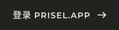

<a href="https://prisel.app"><picture><source media="(prefers-color-scheme: dark)" srcset="assets/hero-dark.svg"></picture></a>

<p align="center"><a href="https://github.com/nerslm/prisel-release"><picture><source media="(prefers-color-scheme: dark)" srcset="assets/lang-en-off-dark.svg"></picture></a><a href="README.zh-CN.md"><picture><source media="(prefers-color-scheme: dark)" srcset="assets/lang-zh-on-dark.svg"></picture></a></p>

<h3 align="center">在任何地方，指挥你自己电脑上的 agent。</h3>

<p align="center">Prisel 在你的电脑上读代码、跑命令、改文件。<br>终端、浏览器和手机连到同一个会话，关掉窗口，它也不会停下。</p>

<p align="center"><a href="https://prisel.app"><picture><source media="(prefers-color-scheme: dark)" srcset="assets/signin-zh-dark.svg"></picture></a>&nbsp;&nbsp;<a href="CHANGELOG.zh-CN.md"><picture><source media="(prefers-color-scheme: dark)" srcset="assets/changelog-zh-dark.svg"></picture></a></p>

这个仓库放 Prisel 的更新日志和问题反馈，不含源码。

## 安装

需要 Node.js 22.19 或更新版本。支持 Linux（x64、arm64）、macOS（Apple 芯片、Intel）和 Windows（x64）。

```bash
npm install -g @nerslm/prisel
prisel            # 在当前目录打开交互会话
prisel web        # 在浏览器里打开同一个会话宿主
prisel update     # 更新到最新版本
```

- 终端和网页连着同一个会话宿主，关掉窗口任务也继续跑。
- 两种后端：Prisel 自己的运行时，或者你电脑上已安装的 Claude Code。
- 子 agent、后台任务和工作流；按模式和规则确认 agent 的操作。

## 在手机和其他设备上用

```bash
prisel host remote login   # 用已登录的手机扫描它显示的二维码：电脑加入你的账号，手机也随即可以使用它
```

然后在任何设备上打开 [prisel.app](https://prisel.app)。电脑只放行配对过的设备：添加新设备时，扫描 `prisel host remote pair` 显示的二维码，或者用已配对的手机扫描新设备显示的二维码。对话和文件留在你的电脑上，浏览器和电脑之间端到端加密。

## 反馈

- Bug 和建议：[Issues](https://github.com/nerslm/prisel-release/issues)。
- 安全问题请不要公开发，见 [SECURITY.zh-CN.md](SECURITY.zh-CN.md)。

## 许可

Prisel 是专有软件，保留所有权利，按 [Prisel 条款](https://prisel.app/terms)使用，见 [LICENSE](LICENSE)。它包含的第三方组件及其许可列在 [THIRD_PARTY_NOTICES.txt](https://prisel.app/licenses/THIRD_PARTY_NOTICES.txt) 里，程序也附带一份。
